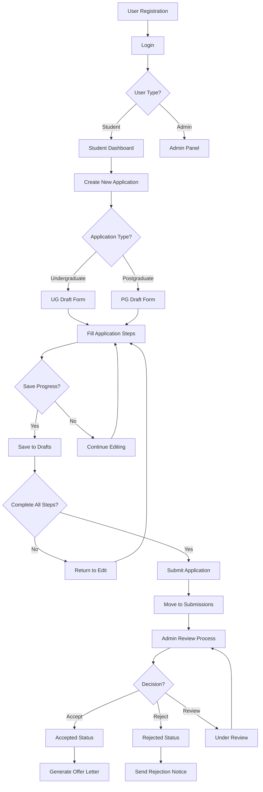
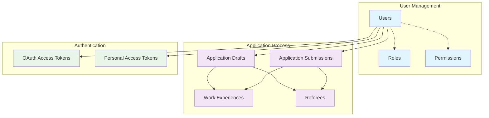
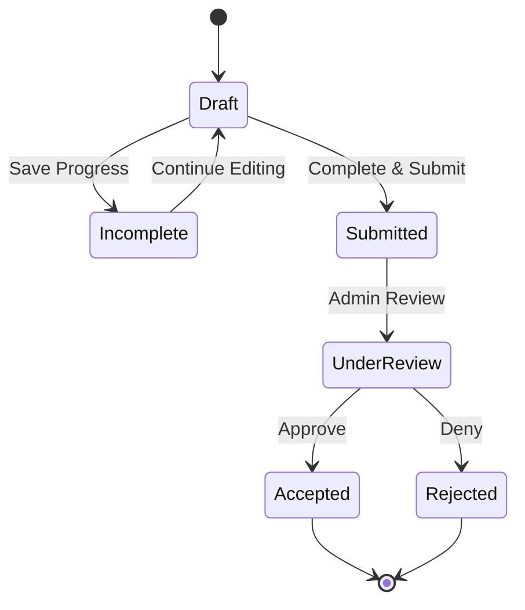

# MUST Portal - Application Flow & Database Relationships

## Application Process Flow



## Core Database Relationships



## Data Structure Overview

### 📊 **Core Application Tables**

| Table | Purpose | Key Fields | Relationships |
|-------|---------|------------|---------------|
| `users` | User accounts | id, email, name, provider | → drafts, submissions |
| `application_drafts` | Work-in-progress | user_id, type, step, %complete | ← user, → work_exp, → referees |
| `application_submissions` | Final applications | user_id, app_id, status | ← user, → work_exp, → referees |
| `work_experiences` | Job history (drafts) | draft_id, org, position, dates | ← draft |
| `submission_work_experiences` | Job history (submitted) | submission_id, org, position, dates | ← submission |
| `referees` | References (drafts) | draft_id, name, institution, email | ← draft |
| `submission_referees` | References (submitted) | submission_id, name, institution, email | ← submission |

### 🔐 **Authentication & Permissions**

| Table | Purpose | Key Fields |
|-------|---------|------------|
| `permissions` | System permissions | id, name, guard_name |
| `roles` | User roles | id, name, guard_name |
| `model_has_roles` | Role assignments | role_id, model_type, model_id |
| `model_has_permissions` | Permission assignments | permission_id, model_type, model_id |
| `oauth_access_tokens` | API authentication | id, user_id, client_id, scopes |
| `personal_access_tokens` | Personal API tokens | id, tokenable_id, tokenable_type |

## Application Status Flow



## Key Business Rules

### 🎯 **Application Limits**
- **Maximum Drafts**: 3 per user (2 types + 1 additional)
- **Application Types**: Undergraduate, Postgraduate only
- **Draft Per Type**: One draft per application type per user

### 📋 **Data Validation**
- **Drafts**: All fields nullable, progress tracking
- **Submissions**: All fields required, unique application ID
- **Status Flow**: Draft → Submitted → Review → Accepted/Rejected

### 🔒 **Security Features**
- **Social Login**: Google, Facebook, Email
- **Session Management**: Configurable timeout
- **Role-Based Access**: Admin, Student roles
- **API Authentication**: OAuth2 with Laravel Passport

## Performance Optimizations

### 📈 **Database Indexes**
```sql
-- User lookups
CREATE INDEX idx_users_email ON users(email);
CREATE INDEX idx_users_provider ON users(provider, provider_id);

-- Application filtering
CREATE INDEX idx_drafts_user_type ON application_drafts(user_id, application_type);
CREATE INDEX idx_submissions_status ON application_submissions(status);

-- Ordering
CREATE INDEX idx_work_exp_order ON work_experiences(application_draft_id, order_index);
CREATE INDEX idx_referees_order ON referees(application_draft_id, order_index);
```

### 🚀 **Query Optimization**
- **Eager Loading**: Relationships loaded efficiently
- **Caching**: Permission and role caching
- **Pagination**: Large result sets handled properly 