# MUST Portal Database Schema

## Entity Relationship Diagram

```mermaid
erDiagram
    %% Core User Management
    users {
        bigint id PK
        string name
        string email UK
        timestamp email_verified_at
        string password
        string provider
        string provider_id
        string avatar
        timestamp last_activity_at
        integer session_timeout
        string remember_token
        timestamp created_at
        timestamp updated_at
    }

    %% Permission System (Spatie Laravel Permission)
    permissions {
        bigint id PK
        string name
        string guard_name
        timestamp created_at
        timestamp updated_at
    }

    roles {
        bigint id PK
        string name
        string guard_name
        timestamp created_at
        timestamp updated_at
    }

    model_has_permissions {
        bigint permission_id FK
        string model_type
        bigint model_id
    }

    model_has_roles {
        bigint role_id FK
        string model_type
        bigint model_id
    }

    role_has_permissions {
        bigint permission_id FK
        bigint role_id FK
    }

    %% Application Drafts (Work in Progress)
    application_drafts {
        bigint id PK
        bigint user_id FK
        enum application_type
        integer current_step
        integer completion_percentage
        string title
        string surname
        string first_name
        string marital_status
        string maiden_name
        date date_of_birth
        string place_of_birth
        string nationality
        string country_of_residence
        enum gender
        string passport_photo_path
        text correspondence_address
        string telephone_numbers
        string email_address
        text permanent_address
        boolean show_permanent_address
        enum level_of_study
        string first_choice
        string second_choice
        string third_choice
        string fourth_choice
        string method_of_study
        string school_name
        string school_from_date
        string school_to_date
        string subjects_studied
        string examination_year
        string results_year
        string grades_achieved
        json subjects_and_grades
        string university_college
        string uni_from_date
        string uni_to_date
        string programme
        string qualification
        string date_of_award
        string class_of_award
        text motivation_essay
        text upload_motivation_note
        string motivation_file_path
        boolean has_disability
        text disability_description
        boolean declaration_agreed
        string declaration_full_name
        timestamp last_saved_at
        timestamp created_at
        timestamp updated_at
    }

    %% Application Submissions (Finalized Applications)
    application_submissions {
        bigint id PK
        bigint user_id FK
        string application_id UK
        enum application_type
        enum status
        string title
        string surname
        string first_name
        string marital_status
        string maiden_name
        date date_of_birth
        string place_of_birth
        string nationality
        string country_of_residence
        enum gender
        string passport_photo_path
        text correspondence_address
        string telephone_numbers
        string email_address
        text permanent_address
        boolean show_permanent_address
        enum level_of_study
        string first_choice
        string second_choice
        string third_choice
        string fourth_choice
        string method_of_study
        string school_name
        string school_from_date
        string school_to_date
        string subjects_studied
        string examination_year
        string results_year
        string grades_achieved
        json subjects_and_grades
        string university_college
        string uni_from_date
        string uni_to_date
        string programme
        string qualification
        string date_of_award
        string class_of_award
        text motivation_essay
        text upload_motivation_note
        string motivation_file_path
        boolean has_disability
        text disability_description
        boolean declaration_agreed
        string declaration_full_name
        timestamp submitted_at
        timestamp created_at
        timestamp updated_at
    }

    %% Work Experience (Draft)
    work_experiences {
        bigint id PK
        bigint application_draft_id FK
        string from_date
        string to_date
        string organization
        string position
        integer order_index
        timestamp created_at
        timestamp updated_at
    }

    %% Work Experience (Submission)
    submission_work_experiences {
        bigint id PK
        bigint application_submission_id FK
        string from_date
        string to_date
        string organization
        string position
        integer order_index
        timestamp created_at
        timestamp updated_at
    }

    %% Referees (Draft)
    referees {
        bigint id PK
        bigint application_draft_id FK
        string name
        string position
        string institution
        text address
        string email
        integer order_index
        timestamp created_at
        timestamp updated_at
    }

    %% Referees (Submission)
    submission_referees {
        bigint id PK
        bigint application_submission_id FK
        string name
        string position
        string institution
        text address
        string email
        integer order_index
        timestamp created_at
        timestamp updated_at
    }

    %% Laravel System Tables
    password_reset_tokens {
        string email PK
        string token
        timestamp created_at
    }

    failed_jobs {
        bigint id PK
        string uuid
        text connection
        text queue
        longtext payload
        longtext exception
        timestamp failed_at
    }

    personal_access_tokens {
        bigint id PK
        bigint tokenable_id
        string tokenable_type
        string name
        string token
        text abilities
        timestamp last_used_at
        timestamp expires_at
        timestamp created_at
        timestamp updated_at
    }

    %% OAuth Tables (Laravel Passport)
    oauth_auth_codes {
        string id PK
        bigint user_id
        bigint client_id
        text scopes
        boolean revoked
        timestamp expires_at
    }

    oauth_access_tokens {
        string id PK
        bigint user_id
        bigint client_id
        string name
        text scopes
        boolean revoked
        timestamp created_at
        timestamp updated_at
        timestamp expires_at
    }

    oauth_refresh_tokens {
        string id PK
        string access_token_id
        boolean revoked
        timestamp expires_at
    }

    oauth_clients {
        bigint id PK
        bigint user_id
        string name
        string secret
        string provider
        text redirect
        boolean personal_access_client
        boolean password_client
        boolean revoked
        timestamp created_at
        timestamp updated_at
    }

    oauth_personal_access_clients {
        bigint id PK
        bigint client_id
        timestamp created_at
        timestamp updated_at
    }

    %% Relationships
    users ||--o{ application_drafts : "has"
    users ||--o{ application_submissions : "has"
    users }o--o{ roles : "has"
    users }o--o{ permissions : "has"
    
    application_drafts ||--o{ work_experiences : "has"
    application_drafts ||--o{ referees : "has"
    
    application_submissions ||--o{ submission_work_experiences : "has"
    application_submissions ||--o{ submission_referees : "has"
    
    roles }o--o{ permissions : "has"
    
    %% OAuth Relationships
    users ||--o{ oauth_access_tokens : "has"
    users ||--o{ oauth_auth_codes : "has"
    oauth_clients ||--o{ oauth_access_tokens : "has"
    oauth_clients ||--o{ oauth_auth_codes : "has"
    oauth_access_tokens ||--o{ oauth_refresh_tokens : "has"
```



## Database Schema Overview

### Core Tables

#### 1. **Users** (`users`)
- **Purpose**: User authentication and profile management
- **Key Features**: 
  - Social login support (Google, Facebook)
  - Session management with timeout
  - Role-based access control
- **Unique Constraints**: Email address

#### 2. **Application Drafts** (`application_drafts`)
- **Purpose**: Store incomplete application forms
- **Key Features**:
  - Progress tracking (current_step, completion_percentage)
  - All application fields are nullable for drafts
  - One draft per application type per user
- **Application Types**: Undergraduate, Postgraduate

#### 3. **Application Submissions** (`application_submissions`)
- **Purpose**: Store finalized and submitted applications
- **Key Features**:
  - Unique application ID (MUST-APP-YYYY-XXXXX format)
  - Status tracking (submitted, review, accepted, rejected)
  - All fields are required for submissions
- **Status Flow**: submitted → review → accepted/rejected

### Supporting Tables

#### 4. **Work Experience** (`work_experiences`, `submission_work_experiences`)
- **Purpose**: Store work history for both drafts and submissions
- **Key Features**: Order indexing for display sequence

#### 5. **Referees** (`referees`, `submission_referees`)
- **Purpose**: Store referee information for both drafts and submissions
- **Key Features**: Order indexing for display sequence

### Permission System

#### 6. **Roles & Permissions** (Spatie Laravel Permission)
- **Purpose**: Role-based access control
- **Tables**: `permissions`, `roles`, `model_has_permissions`, `model_has_roles`, `role_has_permissions`
- **Features**: Flexible permission system with role assignments

### System Tables

#### 7. **Authentication & OAuth** (Laravel Passport)
- **Purpose**: API authentication and token management
- **Tables**: `oauth_*` tables for OAuth2 implementation

#### 8. **System Utilities**
- **Password Reset**: `password_reset_tokens`
- **Job Queue**: `failed_jobs`
- **API Tokens**: `personal_access_tokens`

## Key Relationships

1. **User → Applications**: One user can have multiple drafts and submissions
2. **Draft/Submission → Work Experience**: One-to-many relationship
3. **Draft/Submission → Referees**: One-to-many relationship
4. **User → Roles**: Many-to-many relationship through pivot tables

## Data Flow

```
User Registration → Draft Creation → Form Completion → Submission → Review Process
```

## Business Rules

1. **Draft Limits**: Maximum 3 drafts per user (2 types + 1 additional)
2. **Application Types**: Undergraduate and Postgraduate only
3. **Status Progression**: Draft → Submitted → Review → Accepted/Rejected
4. **Unique Constraints**: 
   - Email per user
   - Application ID per submission
   - One draft per application type per user

## Indexes for Performance

- User email lookup
- Application type filtering
- Status-based queries
- Order indexing for work experience and referees
- OAuth token lookups 